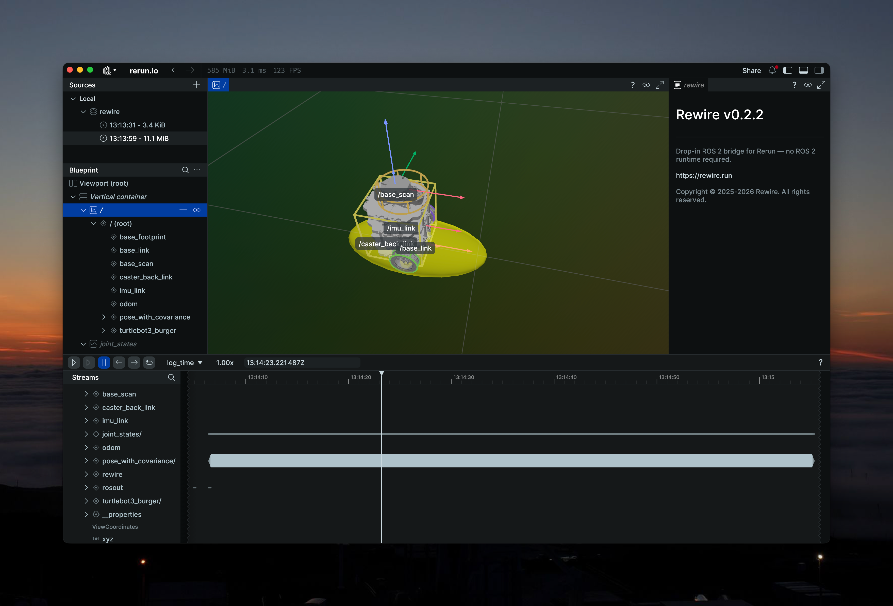

# rewire-turtlebot3

[](https://pixi.sh)

TurtleBot3 Burger simulation for testing [rewire](https://github.com/rewire-run/rewire) with URDF, TF trees,
joint states, and pose with covariance.



## Topics

| Topic | Type | Description |
|---|---|---|
| `/joint_states` | `sensor_msgs/JointState` | Wheel joint positions and velocities |
| `/pose_with_covariance` | `geometry_msgs/PoseWithCovarianceStamped` | Pose with growing uncertainty |
| `/robot_description` | `std_msgs/String` | URDF from `robot_state_publisher` |
| `/tf` | `tf2_msgs/TFMessage` | Dynamic transform: `odom` → `base_footprint` |
| `/tf_static` | `tf2_msgs/TFMessage` | Static transforms from URDF |

## Setup

Requires [pixi](https://pixi.sh).

```bash
pixi install
```

## Usage

```bash
pixi run ros2 launch rewire_turtlebot3 sim.launch.py
```

In a separate terminal, run rewire to visualize in Rerun:

```bash
pixi run rewire record --all
```

## How it works

The launch file starts two nodes:

- **robot_state_publisher** — publishes the TurtleBot3 Burger URDF and static TF tree
- **sim** — drives the robot in a straight line, publishing joint states, dynamic TF, and pose with
  covariance (uncertainty grows over time)
